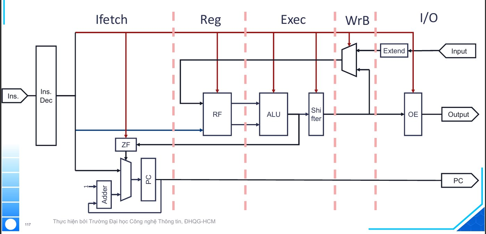

# Simple_Processor_with_Blockdiagram

A fully programmable, instruction-set-based 16-bit CPU implemented on FPGA using Intel Quartus II. The design extends a fixed-function datapath into a general-purpose processor supporting three instruction formats, a branch mechanism, and I/O operations — all decoded by a combinational Instruction Decoder.

---

## 🏗️ Architecture



The processor is organized into five functional stages:

| Stage | Name | Action |
|---|---|---|
| 1 | **Ifetch** | Fetch instruction from Imem(PC), load into IR via Ins. Dec |
| 2 | **Reg** | Read register file (RA, RB) |
| 3 | **Exec** | ALU / Shifter execution |
| 4 | **WrB** | Write-back result to register file; MUX selects ALU result or extended Input |
| 5 | **I/O** | Input read via Extend block; Output driven via OE |

**PC Logic** (bottom-left): the Adder increments PC by 1 each cycle. The MUX selects between `PC+1` and `IMM` based on `BRANCH AND ZF`. The Zero Flag (`ZF`) block detects when the ALU output equals zero, enabling conditional branching.

The original datapath block (`RF → ALU → Shifter → OE`) is kept **unchanged**; the Controller, PC, Adder, ZF, and Instruction Memory are added around it.

---

## 📐 Instruction Set Architecture

### Instruction Formats

| Format | Bit layout | Total |
|---|---|---|
| **RRR** | `OC[3] Rs1[3] Rs2[3] Rd[3] Func[4]` | 16 bits |
| **RRI** | `OC[3] Rs1[3] Rs2[3] Imm[7]` | 16 bits |
| **RI** | `OC[3] Rd[3] Imm[9+]` | 16 bits |

### RRR Instructions (OC = `000`)

| Func | Mnemonic | Operation |
|---|---|---|
| `0000` | `add Rs1, Rs2, Rd` | Rd ← Rs1 + Rs2 |
| `0001` | `sub Rs1, Rs2, Rd` | Rd ← Rs1 - Rs2 |
| `0010` | `inc Rs1, Rd` | Rd ← Rs1 + 1 |
| `0011` | `dec Rs1, Rd` | Rd ← Rs1 - 1 |
| `0100` | `and Rs1, Rs2, Rd` | Rd ← Rs1 AND Rs2 |
| `0101` | `or Rs1, Rs2, Rd` | Rd ← Rs1 OR Rs2 |
| `0110` | `xor Rs1, Rs2, Rd` | Rd ← Rs1 XOR Rs2 |
| `0111` | `nand Rs1, Rs2, Rd` | Rd ← Rs1 NAND Rs2 |
| `1000` | `shl1 Rs1, Rd` | Rd ← Rs1 << 1 |
| `1001` | `shl2 Rs1, Rd` | Rd ← Rs1 << 2 |
| `1010` | `shl3 Rs1, Rd` | Rd ← Rs1 << 3 |

### RRI Instruction (OC = `010`)

| Mnemonic | Operation |
|---|---|
| `beq Rs1, Rs2, Imm` | PC ← (Rs1 == Rs2) ? Imm : PC + 1 |

### RI Instructions

| OC | Mnemonic | Operation |
|---|---|---|
| `100` | `linp Rd` | Rd ← Input |
| `101` | `wout Rd` | Output ← Rd |

---

## 🔧 Controller Design

The Instruction Decoder is a **combinational** block that maps a 16-bit instruction to control signals:

| Signal | Description |
|---|---|
| `IE` | Input Enable — write Input to RF |
| `OE` | Output Enable — send RF value to Output |
| `WE` | Write Enable — write result to RF |
| `RE` | Read Enable — read from RF |
| `BRANCH` | Enable PC branch |
| `OP[2:0]` | ALU operation select |
| `S[1:0]` | Shifter control |
| `WA[2:0]` | RF Write Address |
| `RA[2:0]` | RF Read Address A |
| `RB[2:0]` | RF Read Address B |
| `IMM[15:0]` | Immediate (sign-extended from 8 bits) |

**Decoding strategy:**

- `OC == 000` (RRR): signals from `Func[3:0]`; `WA = IR[6:4]`, `RB = IR[9:7]`
- `OC != 000` (RRI/RI): signals from `OC[2:0]`; `WA = IR[12:10]`
- `wout` (`OC=101`): `RB = IR[12:10]` (same as RA → AND gives the register value → OE outputs it correctly)

---

## 🧪 Test Program & Results

| Hex | Instruction | Expected Result |
|---|---|---|
| `8000` | `linp R0` | R0 = 7 |
| `8400` | `linp R1` | R1 = 5 |
| `00A0` | `add R1, R0, R2` | R2 = 12 |
| `00B1` | `sub R0, R1, R3` | R3 = 2 |
| `0DB2` | `inc R3, R3` | R3 = 3 |
| `0923` | `dec R2, R2` | R2 = 11 |
| `00C4` | `and R0, R1, R4` | R4 = 5 |
| `00C5` | `or R0, R1, R4` | R4 = 7 |
| `00C6` | `nand R0, R1, R4` | R4 = 2 |
| `00C7` | `xor R0, R1, R4` | R4 = -6 |
| `04C8` | `shl1 R1, R4` | R4 = 10 |
| `04D9` | `shl2 R1, R5` | R5 = 20 |
| `04EA` | `shl3 R1, R6` | R6 = 40 |
| `A000` | `wout R0` | Output = 7 ✓ |
| `A400` | `wout R1` | Output = 5 ✓ |
| `A800` | `wout R2` | Output = 11 ✓ |
| `AC00` | `wout R3` | Output = 3 ✓ |
| `B000` | `wout R4` | Output = 10 ✓ |
| `B400` | `wout R5` | Output = 20 ✓ |
| `B800` | `wout R6` | Output = 40 ✓ |
| `4080` | `beq R0, R1, 0` | No branch (7 ≠ 5) |
| `4A80` | `beq R2, R5, 0` | No branch (11 ≠ 20) |

> **Note on inc/dec glitch:** The ALU is combinational, so `inc`/`dec` momentarily produces two values per cycle. The Register File only latches on the rising clock edge, so the transient value is discarded with no functional impact.

---

## 📊 Implementation Results

**Target device:** Cyclone II — EP2C35F672C6

### Resource Usage

| Resource | Usage |
|---|---|
| Estimated Total Logic Elements | **522** |
| Total Combinational Functions | 409 |
| — 4-input LUT | 302 |
| — 3-input LUT | 83 |
| — ≤2-input LUT | 24 |
| Total Registers | **161** |
| I/O Pins | 69 |
| Embedded Multiplier 9-bit | 0 |

### Timing

| Model | Fmax | Clock |
|---|---|---|
| Slow 1200mV 85°C | **78.7 MHz** | CLK |

### Power

| Metric | Value |
|---|---|
| Total Thermal Power | **116.04 mW** |
| Core Dynamic | 0.00 mW |
| Core Static | 79.94 mW |
| I/O Thermal | 36.09 mW |

---

## 📁 Project Structure

```
Simple_Processor_with_Blockdiagram/
├── LENHCOBAN.bdf        # RRR decoder (OC = 000)
├── LENHMORONG.bdf       # RRI/RI decoder (OC ≠ 000)
├── CONTROLLER.bdf       # Top-level controller
├── ZERO.bdf             # Zero flag detector
├── PC.bdf               # PC logic (Zero + Adder + MUX)
├── Datapath.bdf         # Original datapath (RF+ALU+Shifter+OE) — unchanged
├── PROCESSORREAL.bdf    # Top-level processor
├── lab3.sim.vwf         # Functional simulation waveform
├── lab3.vwf             # Gate-level timing simulation waveform
├── architecture.png     # CPU block diagram
└── README.md
```

---

## ⚙️ How to Run

1. Open `PROCESSORREAL.bdf` as the top-level entity in Quartus II
2. Compile: **Processing → Start Compilation**
3. Load the test program into Instruction Memory (ROM init file)
4. **Functional simulation:** open `lab3.sim.vwf` → Simulation → Run Functional Simulation
5. **Gate-level timing:** open `lab3.vwf` → Simulation → Run Gate-Level Simulation
6. **Resource report:** Processing → Compilation Report → Analysis & Synthesis → Resource Usage Summary
7. **Timing report:** Tools → TimeQuest Timing Analyzer → Fmax Summary
8. **Power report:** Processing → Compilation Report → Power Analyzer → Summary
